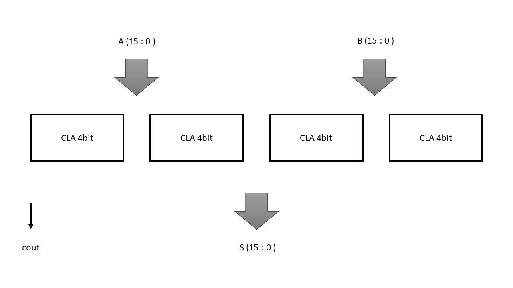

# Consegna 1

Descrivere in VHDL un circuito sommatore a 16 bit usando quattro moduli Carry Look Ahead (CLA) a 4 bit collegati come un Ripple Carry (RC).

Simulare almeno sette combinazioni degli input.